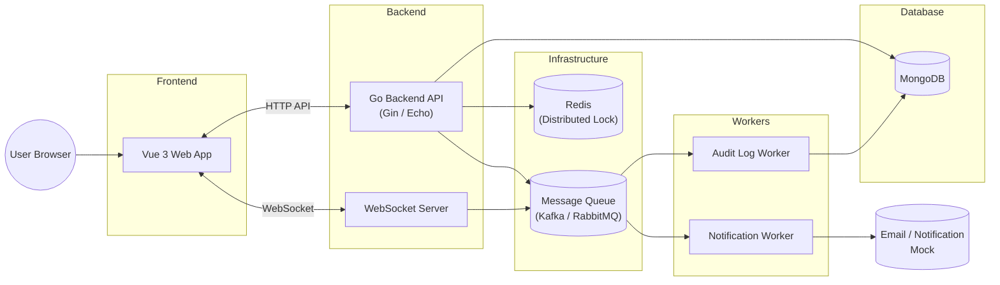

# 🎬 ระบบจองตั๋วภาพยนตร์ (Movie Ticket Booking System)

โปรเจกต์นี้เป็น Backend API ถูกพัฒนาด้วย **Golang**

---

## 🛠 Tech Stack

- **Language:** Golang (1.20+)
- **Framework:** Gin
- **Database:** MongoDB
- **Caching & Locking:** Redis Distributed-Lock
- **Message Broker:** RabbitMQ Event-Driven
- **Real-time Engine:** WebSockets
- **Authentication:** Firebase Auth
- **API Docs:** Swagger UI

---

## 🏗 System Architecture

Copy และนำไปแสดงผลที่ https://mermaid.js.org/



_(หมายเหตุ: แผนภาพแสดงการเชื่อมต่อระหว่างระบบหน้าบ้าน, หลังบ้าน, ตัวจัดการคิว และฐานข้อมูล)_

---

## ✨ Highlight Features

### 1. Concurrency & Distributed Lock 🔒

เมื่อมีผู้ใช้ 2 คนพยายามกดยืนยันจอง "ที่นั่ง A1" ในรอบฉายเดียวกัน พร้อมกัน ระบบจะปฏิเสธการจองคนที่ช้า

### 2. Event-Driven & RabbitMQ 🐇

เก็บประวัติการใช้งาน (Audit Log)

- เมื่อผู้ใช้ทำรายการเสร็จ API จะแค่โยนข้อความแคปซูล (Message Payload) ฝากไว้ที่ **RabbitMQ** แล้วตอบกลับผู้ใช้ทันที

### 3. Real-Time WebSockets ⚡

- **หน้าจอการจองของลูกค้า (`/ws/seats`):** หากมีลูกค้าคนอื่นจองที่นั่ง A1 สำเร็จ ที่นั่ง A1 บนหน้าจอผังที่นั่งของผู้ใช้คนอื่นทั้งหมด จะเปลี่ยนเป็นสีแดง (Booked) โดยอัตโนมัติ
- **หน้าจอมอนิเตอร์แอดมิน (`/ws/auditlogs`):** หากใครทำรายการใด ๆ (เพิ่ม/ลบ/จอง) ข้อมูล Audit Log จะเด้งขึ้นบน Dashboard ของแอดมินแบบเรียลไทม์

---

## 📂 Project Structure

```text
/
├── api/             # ไฟล์รวมการตั้งค่า Route เส้นทางของ API ทั้งหมด
├── cmd/server/      # Start
├── docs/            # ไฟล์สำหรับ Swagger API Documentation
├── internal/
│   ├── config/      # environment variables (.env)
│   ├── database/    # ฟังก์ชันเชื่อมต่อ Database และสร้าง Indexes
│   ├── events/      # รูปแบบ Model สำหรับส่งข้อมูลข้าม RabbitMQ
│   ├── handlers/    # (Controller) รับ HTTP Request -> เรียก Service -> ส่ง HTTP Response
│   ├── middleware/  # Middleware Request Auth ตรวจ Token, Role Admin
│   ├── models/      # MongoDB Models
│   ├── queue/       # การเชื่อมต่อข้อมูลกับ RabbitMQ
│   ├── repositories/# Database Layer MongoDB (Find, Insert, Update, Delete)
│   ├── services/    # Business Logic Layer
│   └── websocket/   # Socket Connection และส่งข้อมูล Real-time
├── pkg/
│   ├── redislock/   # ฟังก์ชั่น Lock และ Unlock ด้วย Redis
│   └── utils/       # ฟังก์ชัน Helper ย่อยางการแพ็ค Response คืนค่า API
└── worker/          # RabbitMQ (Consumers)
```

---

## 🚀 How to run

### สิ่งที่ต้องมี:

- Docker และ Docker Compose (สำหรับรัน MongoDB 8.2.6-rc0, Redis 8.6.1, RabbitMQ 4.2.4-management-alpine)
- Go 1.20 ขึ้นไป

### 1. Docker

คำสั่งรัน Service พื้นฐานขึ้นมาก่อนเข้าตัว API

```bash
docker-compose up -d
```

### 2. Environment Variables

- Env file
- ตรวจสอบให้แน่ใจว่าได้วางไฟล์ `serviceAccountKey.json` ของ Firebase ในโฟลเดอร์ `internal/middleware`

### 3. รัน Backend API Server

```bash
go run cmd/server/main.go
# หรือรันผ่าน Air เพื่อทำ Auto-reload
air
```

### 4. เข้าดู API Documentation

ระบบจะรันขึ้นมาที่พอร์ต `8080` เปิดดู Swagger เพื่อดู Endpoints ทั้งหมด:
👉 **[http://localhost:8080/swagger/index.html](http://localhost:8080/swagger/index.html)**

---

## 🔄 Booking System Flow

1. **Client Request:** ยิง API ขอยืนยันที่นั่ง "A1" และ "A2"
2. **Controller (Handler):** ส่งข้อมูลต่อให้ `BookingService`
3. **Locking (Redis):** Lock ที่นั่งทั้งคู่ หากมีคนแย่งจองที่เบอร์เดิมซ้ำกันอยู่ในวินาทีเดียวกัน จะตอบกลับเป็น Error คนที่มาทีหลัง
4. **Operation (MongoDB -> Repo):** ส่งสถานะไปที่ `SeatRepository` สลับจาก `AVAILABLE` -> `LOCKED`
5. **Operation (Transactions):** สร้าง Record การจอง (`bookings`) สถานะเริ่มต้นเป็น `PENDING`
6. **API Response:** ตอบ 200 OK ให้ชำระเงิน (ในเวลา 5 นาที)
7. **Payment Success:** ชำระโอนเงินสำเร็จ
8. **Asynchronous Hand-off (RabbitMQ):** สถานะตั๋วหนังเป็น `SUCCESS` พร้อมทั้ง Event Publisher ไปยัง `RabbitMQ` เช่น `audit_events` และ `booking_events`
9. **Background Execution (Workers):** พนักงานคิวสูบข้อมูลไปทำเบื้องหลัง:
   - _Audit Log Worker_
10. **Real-time Engine (WebSockets):** WebSocket สำหรับการอัปเดต
    - คนจอง -> ที่นั่ง A1, A2 เปลี่ยนกรอบสีแดงพร้อมกัน
    - หน้าแอดมิน -> เห็นบันทึกของ Audit Log

---
